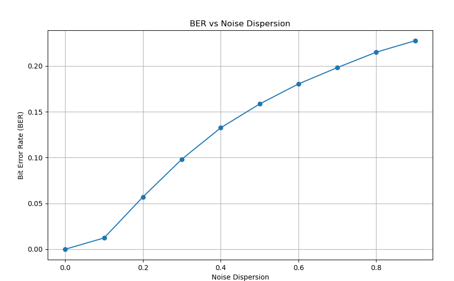
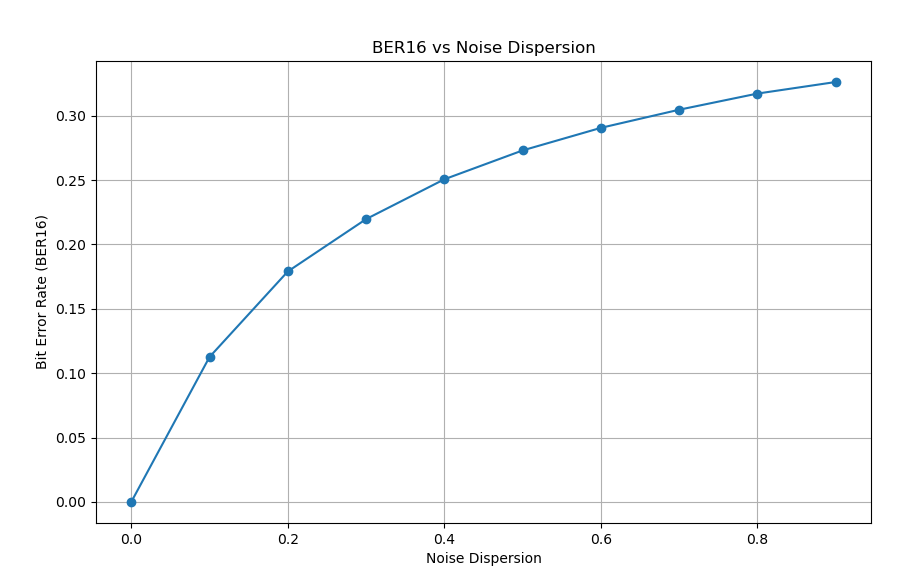
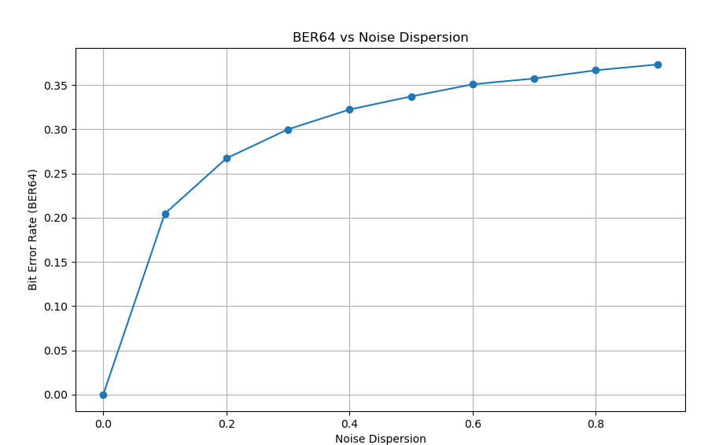

# Задание на стажировку
1. Написать на языке С++ класс выполняющий функциональность модулятора QAM (QPSK,
QAM16, QAM64)
2. Написать на языке С++ класс выполняющий функциональность добавления гауссовского
шума к созвездию QAM
3. Написать на языке С++ класс выполняющий функциональность демодулятора QAM (QPSK,
QAM16, QAM64)
4. Написать последовательный вызов 1-3 для случайной последовательности бит для разных
значений дисперсия шума
5. Построить график зависимости вероятности ошибки на бит от  дисперсии шума
# Комментарий
Данный код выполнен на C++ и python. Все расчёты и классы выполнены на C++. На вход поступает случайная последовательность бит, после чего проходит процедуры модуляции и демодуляции QAM (QPSK, QAM16, QAM64), с наложением гауссовского шума. На выход приходит 3 txt файла, в котором хранится дисперсия шума и ошибка на бит. Построение графиков выполнено на Python. На вход поступает 3 txt файла с дисперсией шума и ошибок на бит. На выход поступает графики данных зависимостей.
# Запуск кода на ubuntu 22.04
>./run.sh

# Пример графиков

